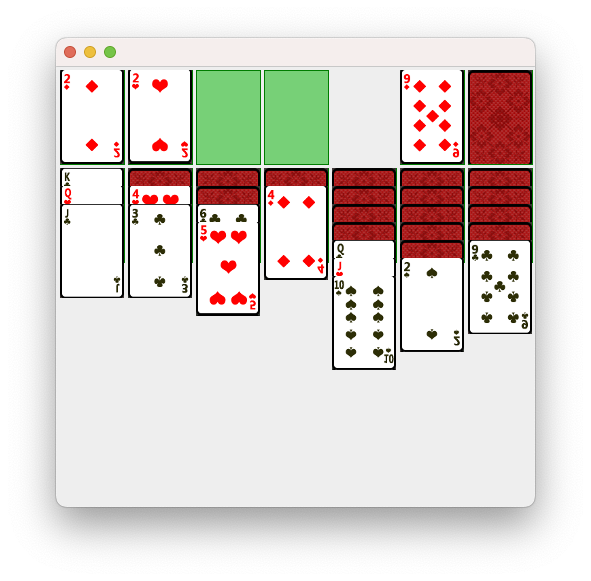

# NotSolitaire
A **very** basic implementation of solitaire using Swing

This is **NOT** a full implementation and I've deliberatly left some parts incomplere, the intention is to provide a learning jumping off point.

* Support for double clicking the ACE "waste" card so it will automatically is added to the suit pile
* Support for drag and drop, including multiple card stack

# What could be better
* The card images - they are crap, but they are just a stand in.
* The code could be better decoupled and/or make use of an appropriate rules engine, but the intention is to provide an initial jumping off point.
* Image scaling is very basic and could use a better overall approach
